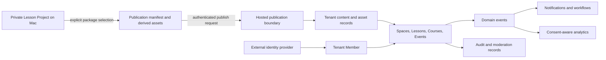

# Community Platform Architecture and Product Boundaries

## Decision

LessonMeld will use a hybrid product model:

- The existing macOS app and `dmlesson` CLI remain private, local-first authoring tools in this repository.
- A separately deployed hosted service owns community identity bindings, tenant data, member content, access, commerce, communication, moderation, analytics, and integrations.
- A person must explicitly create a Publication before any selected lesson output crosses from local authoring into a hosted Tenant.
- The first release operates one Digital Meld Tenant on a tenant-aware foundation. White-label tenant provisioning, self-hosting, and branded mobile apps are later phases, not first-release requirements.

This boundary preserves the working privacy model while allowing the community roadmap to use infrastructure that cannot responsibly live inside a desktop application.

## First community release

The first release proves one complete community loop:

1. An invited person authenticates and becomes a Member of the launch Tenant.
2. An authorized Member enters a Space and can discover permitted content.
3. A creator explicitly publishes one derived LessonMeld video and selected metadata.
4. Members can view the Lesson, create Posts and Comments, react, and receive in-app Notifications.
5. Moderators can review reports, apply a reversible sanction, and inspect an Audit Event trail.
6. A Member can export or delete eligible personal data without touching another Member or Tenant.

### Explicit non-goals

- Uploading or synchronizing complete `.dmlm` projects.
- Background upload of raw captures, local transcripts, media paths, or authoring history.
- Public tenant signup, tenant self-provisioning, or white-label custom domains.
- Self-hosted distribution.
- Direct messages, live streaming, payments, marketing automation, AI features, or native mobile apps in the first release.
- First-party password storage, payment-card storage, video conferencing infrastructure, email delivery infrastructure, or foundation-model hosting.
- Claims of SOC 2, HIPAA, FERPA, COPPA, or other certification before the required legal and operational program exists.

## Product and repository boundaries

| Boundary | Owns | Must not own |
| --- | --- | --- |
| Native authoring, this repository | Capture, `.dmlm` projects, editing, rendering, local transcripts, local settings, publication package creation, explicit publish/revoke commands | Hosted sessions, tenant member records, payments, hosted message state, analytics collection, background sync |
| Hosted community, separate codebase | Tenant APIs, member/profile/role state, hosted content, published assets, events, courses, commerce, notifications, moderation, audit, exports, integration adapters | Raw private projects, local file paths, capture permissions, native signing credentials |
| External identity provider | Authentication ceremony, credential and factor verification, recovery, enterprise federation when enabled | Tenant roles, profiles, content ownership, entitlements, moderation state |
| Payment processor | Payment method vault, payment authorization, settlement, disputes, processor event truth | Community authorization, course progress, tenant role decisions |
| Media/live providers | Object delivery or live-room transport behind tenant-authorized adapters | Lesson source projects, platform authorization, long-term domain ownership |

The hosted codebase should begin as a modular monolith with one transactional database, one deployable API/application boundary, and internal domain modules. Separate services are introduced only when load, isolation, or independent lifecycle evidence justifies them.

## Context and data flow

No reverse arrow represents project synchronization. A hosted Publication can be replaced or revoked, but the hosted service never edits the private source project.

## Domain ownership model

Every hosted aggregate carries a non-null `tenant_id`. IDs are globally unguessable, but identifier shape is not an authorization control. Cross-tenant foreign keys are prohibited; tenant identity is included in unique constraints, lookups, jobs, cache keys, object keys, and event envelopes.

| Domain | Aggregate ownership and relationships | Source of truth |
| --- | --- | --- |
| Tenant and Community | Tenant owns one initial Community, configuration, branding, domains, policies, retention, and feature state | Hosted platform |
| Identity and Member | Identity can bind to one Member per Tenant; Member owns Profile, status, preferences, Roles, Segments, consent, and authored-content references | Identity provider for authentication; hosted platform for membership |
| Role and Permission | Tenant owns Roles; Roles grant Permissions; Member-role assignments are tenant-scoped and time-audited | Hosted authorization module |
| Space | Tenant owns Spaces; Space defines visibility, membership policy, navigation, and allowed content types | Hosted community module |
| Post, Comment, Reaction | Member authors content inside one Space; content inherits tenant and visibility; moderation state never changes ownership | Hosted discussion module |
| Channel, Conversation, Message | Tenant owns Channels; explicit participants own access to Conversations; Message belongs to exactly one stream | Hosted messaging module |
| Event, RSVP, Live Session, Replay | Tenant owns Event; Member owns RSVP; Event can open one or more Live Sessions and publish Replay assets | Hosted events module; provider only for transport |
| Course, Curriculum, Lesson | Tenant owns Course and ordered Curriculum; Lesson may reference one Publication; Space can expose Courses | Hosted learning module |
| Enrollment and Progress | Member owns Enrollment state; Progress belongs to Enrollment and references a curriculum version | Hosted learning module |
| Offering, Price, Purchase, Subscription, Coupon | Tenant owns catalog; processor references attach to commerce records; successful commerce grants Entitlements | Hosted commerce module; processor for transaction facts |
| Entitlement | Tenant grants Entitlement to Member for a resource or capability; roles do not substitute for paid access | Hosted entitlement module |
| Challenge, Badge, Award, Leaderboard, Reward | Tenant owns definitions and rules; Member receives Awards or Rewards; Leaderboard is a bounded projection, never authorization truth | Hosted recognition module |
| Site, Page, Domain Mapping | Tenant owns public Site, versioned Pages, branding, navigation, and verified hostnames; published content is referenced, not duplicated without policy | Hosted acquisition module |
| Notification and Digest | Domain events request Notifications; Member preferences and consent select channels; Digest groups eligible notifications | Hosted notification module |
| Broadcast, Form, Submission, Segment | Tenant owns outbound content and Forms; Submission belongs to Tenant and subject Member/contact; Segment selects an audience | Hosted audience module |
| Workflow | Tenant owns Trigger and constrained Actions; execution references immutable event input and produces audited outcomes | Hosted automation module |
| Moderation Case | Tenant owns reports, evidence references, decisions, sanctions, and appeals; case access is permission-scoped | Hosted trust module |
| Domain Event and Audit Event | Aggregate transaction emits Domain Event through an outbox; security/admin actions append Audit Events separately | Hosted platform |
| Integration and Webhook | Tenant authorizes scoped Integration; Webhook delivery is derived, signed, retryable, and revocable | Hosted integration module |
| Analytics | Consent-aware product events reference tenant/member pseudonymous IDs and an owned event schema | Hosted analytics boundary |
| Generated Suggestion | AI request snapshots authorized inputs; output remains reviewable and attributed until accepted | Hosted AI boundary |
| Export | Tenant or eligible Member requests a versioned portable package; export observes current authorization and retention policy | Hosted data-rights module |
| Media Asset and Publication | Tenant owns hosted copy; Publication records local package schema/version and selected asset checksums without a local source path | Hosted publication module |

## Authorization invariants

- Authentication never implies tenant membership.
- Every request resolves one Tenant before loading tenant-owned data.
- Authorization is deny-by-default and checks permission, resource Tenant, Space visibility, ownership, entitlement, and moderation state as applicable.
- Administrators receive named Roles; there is no global tenant `is_admin` shortcut.
- Platform support access is separate from tenant Roles, time-bounded, reason-coded, and audited.
- Background jobs and webhook handlers carry the same tenant and authorization context as interactive requests.
- Object storage is private. Downloads use short-lived, resource-authorized URLs.
- Cache keys, search indexes, analytics events, logs, and queues preserve tenant partitioning.
- Tests must attempt cross-tenant reads, writes, search, asset access, job execution, export, and webhook delivery.

## Native-to-hosted publication contract

Publication is an explicit export protocol, not synchronization.

1. The native app or CLI asks the person to select a Tenant, destination, derived assets, title/description, transcript/caption inclusion, and visibility.
2. The native core creates a versioned manifest with asset names, media types, byte sizes, SHA-256 values, and publishable metadata. It omits absolute local paths, raw project history, credentials, and unselected files.
3. The hosted API creates a scoped, expiring upload session after tenant authorization and quota checks.
4. The client uploads selected assets directly to private object storage with checksums and fixed size/content-type constraints.
5. The hosted service validates all objects, commits the Publication transaction, emits `PublicationCreated`, and schedules safe derivatives.
6. Replacement creates a new Publication version. Revocation removes member access and schedules asset deletion under retention policy; it does not delete the local Lesson Project.

The first contract is package-based so CLI, app, migration tools, and future integrations share one deterministic boundary. Continuous project sync is not planned.

## Integration boundaries

Integration choices are protocol-first. Vendor selections and production dependencies require separate reviewed decisions.

| Capability | Owned boundary | Initial policy |
| --- | --- | --- |
| Identity | OIDC/OAuth 2.1 adapter maps provider subject to Identity and tenant invitation | Managed external authentication; no first-party passwords |
| Database | Transactional relational store with tenant-aware constraints, migrations, backups, point-in-time recovery, and row-level defense | PostgreSQL-compatible service; domain authorization remains mandatory above row policy |
| Object storage and delivery | Private bucket adapter with checksums, malware/media validation hooks, signed upload/download, lifecycle deletion | S3-compatible contract plus CDN for authorized public derivatives |
| Async work | Transactional outbox feeds idempotent jobs; each job carries tenant, actor/system reason, and trace ID | One durable queue initially; no synchronous vendor callback as domain commit |
| Email | Notification adapter renders owned templates after consent and suppression checks | Transactional email first; marketing broadcast waits for consent and unsubscribe controls |
| Payments | Hosted checkout and signed webhook adapter translate processor events into commerce facts | No card data in LessonMeld; entitlements are granted only from verified processor state |
| Video and live | Provider adapter creates rooms and ingests signed completion callbacks; Replay becomes a Media Asset | External provider first; no first-party real-time media infrastructure |
| Analytics | Owned versioned event catalog feeds an isolated analytical store after consent/retention filtering | No analytics in native normal operation; tenant dashboards use hosted events only |
| AI | Provider-neutral job adapter receives an authorization-filtered snapshot and declared purpose | Off by default, no training on tenant data, human review for moderation/content changes |
| Mobile push | Device-registration and delivery adapter scoped to Member, Tenant, app, and consent | Deferred until stable responsive APIs; APNs/FCM credentials remain server-side |
| Public API and webhooks | Versioned tenant-scoped API plus signed, replay-resistant webhook delivery | Least-privilege tokens, rotation, rate limits, delivery audit, and export-safe payloads |

## Privacy and data ownership

### Data that remains local unless explicitly selected

- Complete `.dmlm` Lesson Projects and edit history.
- Raw screen, microphone, webcam, and system-audio captures.
- Absolute file paths, local device identifiers, permission state, and diagnostics.
- Local transcripts, captions, annotations, and agent manifests not selected for Publication.
- Local settings, presets, config backups, app-control tokens, and signing material.

### Hosted ownership and rights

- A Tenant controls its configuration, spaces, catalog, moderation, integrations, and business records.
- A Member controls eligible profile fields, preferences, consent, and rights requests; authored content remains associated with the Member subject to tenant policy and legal retention.
- Payment credentials stay with the processor. LessonMeld stores references and required transaction facts.
- Provider contracts must prohibit using tenant data to train shared models or for unrelated advertising.
- Export and deletion are product capabilities, not manual database procedures.

### Retention baseline

- Each data class has a documented purpose, owner, default retention, deletion trigger, and legal-hold behavior before production use.
- Audit, commerce, abuse, and consent records can have different retention from member content, but access remains narrow and documented.
- Deleted content leaves member-facing reads immediately, then follows bounded asynchronous purge from primary storage, search, caches, derivatives, and object storage.
- Backups have encrypted bounded retention; deletion from backups occurs through expiry, with restoration procedures reapplying tombstones.

## Security and compliance baseline

The first hosted production release must have:

- Threat modeling for tenant isolation, identity linking, invitations, authorization, publication uploads, object delivery, moderation, webhooks, exports, and support access.
- Central authorization policy tests and database constraints for every tenant-owned relationship.
- MFA support for tenant administrators through the identity provider and step-up authentication for sensitive actions.
- Encryption in transit and at rest, managed secret storage, rotation procedures, and no secrets in logs or client bundles.
- Structured security logs with data minimization, immutable Audit Events, alerting, rate limits, abuse controls, and incident response ownership.
- Signed webhook verification, idempotency, replay protection, bounded retries, and dead-letter review.
- Dependency, container, infrastructure, migration, and backup restore checks in CI/release gates.
- Member export, correction, consent withdrawal, and deletion paths plus tenant export and offboarding.
- Accessibility, privacy, terms, acceptable-use, copyright/takedown, moderation, and retention policies reviewed before public signup.

The engineering baseline should target OWASP ASVS Level 2 controls and privacy operations compatible with GDPR/CCPA rights. That target is not a certification claim. Education or child-directed deployments require a separate legal and product decision before collecting the associated data.

## Sequencing and migration

### Phase 0: boundary and trust foundation

- Accept this architecture decision and glossary.
- Approve and create the separate hosted codebase and deployment ownership.
- Define tenant/member schema, authorization policy, event envelope, audit schema, retention classes, and publication manifest.
- Establish migrations, rollback, backups, restore tests, secrets, environments, CI, observability, and incident ownership before member content.

### Phase 1: one-tenant community tracer

- Invitation-based identity and Member/Profile lifecycle.
- Roles, Permissions, tenant isolation, Audit Events, and support-access controls.
- Spaces, Posts, Comments, Reactions, reports, moderation, and in-app Notifications.
- Explicit native Publication of one video/caption package into one Lesson.
- Member data export/deletion and tenant backup/export foundation.

### Phase 2: learning, events, and commerce

- Courses, Curriculum, Enrollment, and Progress on stable content/authorization contracts.
- Events, RSVP, external Live Session adapter, and Replay publication.
- Offerings, Prices, checkout, Purchases, Subscriptions, Coupons, and Entitlements.

### Phase 3: operations and ecosystem

- Email, Broadcasts, Forms, Segments, Workflows, and consent-aware Analytics.
- Public API, signed Webhooks, integrations, embeds, SSO, and migration tooling.
- Tenant provisioning, branding, custom domains, and white-label operations after isolation evidence.

### Phase 4: AI and mobile

- AI suggestions only after authorization, visibility, consent, retention, provenance, evaluation, and human-review controls are stable.
- Mobile/PWA clients only after responsive member APIs, notification preferences, deep links, and account deletion are stable.

Existing native users require no data migration. The app remains fully useful without a hosted account. A future hosted opt-in begins with Tenant selection and explicit Publication; no local project is enrolled automatically.

## First implementation tranche

The first hosted implementation should be split into reviewable tracer bullets:

1. Hosted repository bootstrap, environments, migrations, rollback, health, and CI.
2. Tenant, Identity binding, invitation, Member, Profile, Role, Permission, and authorization test harness.
3. Immutable Audit Event and transactional Domain Event/outbox foundations.
4. Private object storage upload session and versioned Publication manifest validation.
5. One Space plus Post/Comment/Reaction vertical slice with moderation report and in-app Notification.
6. Member export/deletion and tenant backup/restore proof.
7. Native CLI publication plan/inspect commands using safe metadata-only output before any execute command.

No production dependency or vendor contract is approved by this document. Each codebase bootstrap or vendor selection remains a scoped, reviewed issue with operational cost, exit path, data handling, and failure-mode evidence.

The dependency-wired implementation backlog is maintained in [Community Platform Delivery Map](COMMUNITY_PLATFORM_ROADMAP.md). Work starts only from its current frontier.

## Primary risks and controls

| Risk | Control |
| --- | --- |
| Cross-tenant data exposure | Tenant-qualified constraints and queries, centralized authorization, adversarial isolation tests, private object keys |
| Native privacy regression | Explicit Publication only, metadata-safe manifests, no background sync, no local paths, app remains usable offline |
| Vendor lock-in | Owned domain records and adapters, portable exports, provider references isolated from authorization |
| Webhook/event duplication | Idempotency keys, transactional outbox, monotonic aggregate versions, replay-safe consumers |
| Moderation abuse or overreach | Evidence-preserving cases, separated permissions, reasoned actions, appeals, immutable audit |
| Payment grants without settlement | Verified signed processor events, explicit state machine, separate Entitlement records |
| Analytics consent drift | Owned event catalog, purpose and retention metadata, consent filtering before analytical ingestion |
| AI data leakage or unsafe action | Authorized snapshots, purpose limits, provider retention controls, output provenance, human acceptance |
| Premature service sprawl | Modular monolith default and evidence required before extracting a service |
| Unbounded white-label complexity | One operated Tenant first, tenant-aware schema now, self-service provisioning later |

## Decisions deferred to issue-backed work

- Hosted repository name, runtime language/framework, cloud, region, and deployment platform. [ADR 0002](adr/0002-hosted-community-runtime-and-deployment-baseline.md) records the proposed baseline pending explicit approval in issue #288.
- Specific identity, payment, email, object storage, live video, analytics, AI, and push providers.
- Pricing, legal entity/merchant model, tax handling, refund policy, and mobile in-app purchase scope.
- Exact default retention periods and launch jurisdictions.
- PWA versus native mobile packaging and branded-app operating model.
- Self-hosted packaging and support policy.

These choices do not block the domain and privacy boundaries above. They do block production implementation in their respective areas and require separate approved decisions.
